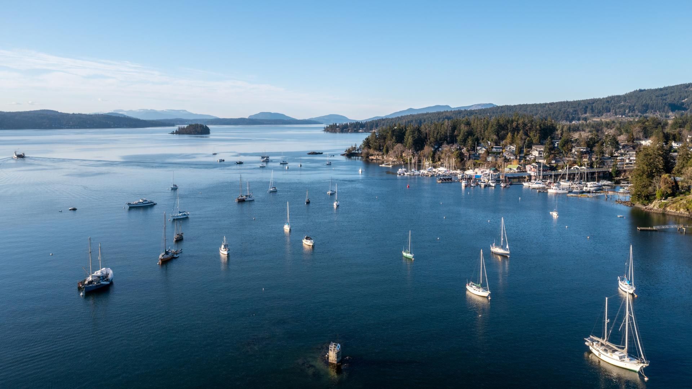
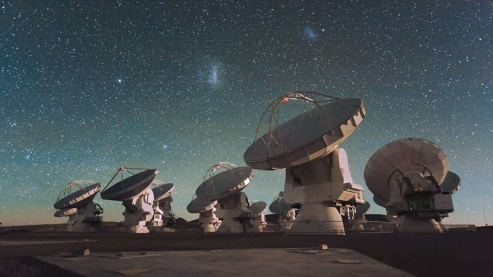
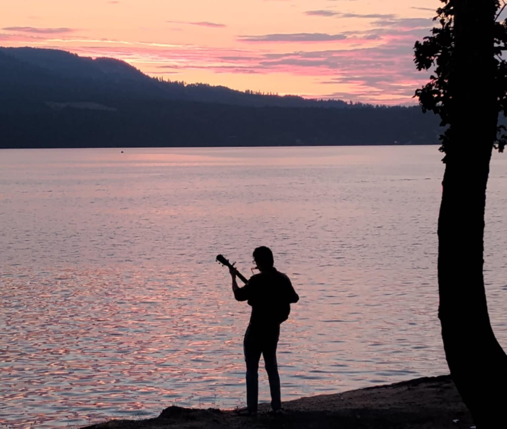
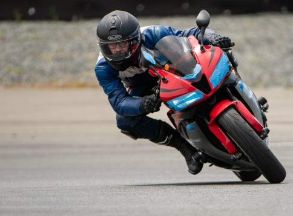
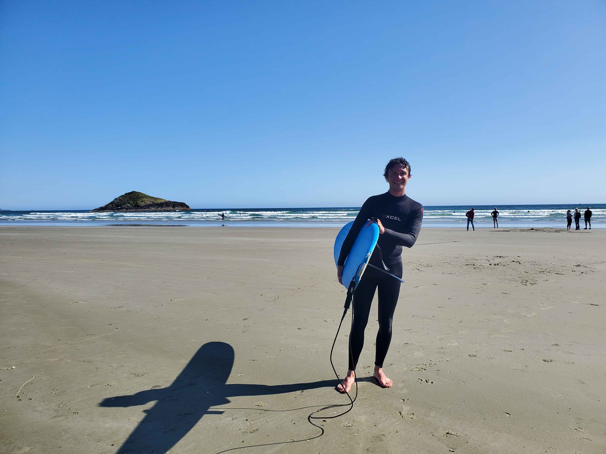

# About Me

I was born and raised in Brentwood Bay, British Columbia, Canada, about 30 minutes from the provincial capital of Victoria on Vancouver Island. Growing up I became interested in all kinds of things - my Dad is a software engineer and a pilot, and encouraged me through school. I loved world history, creative writing, aviation and more. I did well in school, and became interested in astronomy and engineering through a spaceflight passion I developed between middle school and high school. Around this time I also learned to play acoustic and electric guitar. Amid the academic things I loved, I also took classes in musical theatre, advanced AP Literature, and participated in a project called 'Global Perspectives', a two year class about human issues in our own community and worldwide, which culminated in my paying my own way to travel to India and renovate an elementary school in Kerala province. While I was in middle and high school, I also began training as a private pilot. I got as far as my first solo (the first time a student flies a plane on their own) before the savings which would have gone towards the expensive training were put towards the aforementioned trip.

{align="left": style="width:1"}
Brentwood Bay - where I grew up

I did my undergraduate degree at the University of Victoria (UVic), near where I grew up in Victoria, BC. My degree is a combined major in physics and astronomy which I completed in the honours program, and was awarded with distinction. During the degree I was a part of various projects. I spent 8 months working full-time as a member of a working group creating video tutorials about a field of astronomy called Radio Interferometry for other astronomers. These videos are featured on the science website of one of the world's foremost observatories, the Atacama Large Millimeter Array (ALMA), and at time of writing the continuing series has over 11,000 views on youtube (comparable to the size of the entire world's professional astronomical community). I also did 4 months of research, supervised by Dr. Justin Albert (UVic faculty), on the prospect of calibrating ground-based optical telescopes not with variable, distant calibration stars, but with precisely engineered low-earth-orbit (LEO) light sources. This is the subject of a first-author paper of mine in the final stages of review, and recommended for publication, with the American Astronomical Society (AAS) Journals.

{align="left": style="width:1"}
The Atacama Large Millimetre Array

{align="left": style="width:1"}
My most awkward graduation photo...

Since 2024, I've been a master's student in astronomy and astrophysics at the Trottier Space Institute, at McGill University in Montreal, Canada. I'm a part of the McGill Extreme Gravity and Accretion Group (MEGA), supervised by Dr. Daryl Haggard, and the Cosmic Dawn research group, supervised by Dr. Adrian Liu. My greatest interests are in cosmology, that is the study of the universe at its largest scales of time and space, and extreme gravity, caused by objects like black holes and neutron stars. In my ongoing Master's research, I'm evaluating how an upcoming cutting-edge cosmology telescope, the Canadian Hydrogen Observatory and Radio Transient Detector (CHORD), could be used to look for long radio transients; come-and-go flashes of bright radio emission caused by a range of extreme astrophysical events, the study of which provides insight into fundamental physics.

I'm passionate about a great deal of things, and I'm determined to find my way to a life where I can enjoy and explore all of them, from advancing our understanding of our universe, to music and more. 

## Outside of Academia

- I'm a guitarist, singer and songwriter. My musical tastes have great variety, from classical music to metal and electronic, but my own music is indie-folk and roots music, centered around acoustic guitar and sometimes harmonica. I'm working on expanding back into this part of my life, which was largely put aside through my undergrad, but more is to come soon!

{align="left": style="width:1"}

- My transportation of choice is on two wheels, not four. I started riding motorcycles at the beginning of undergrad and since have gone on road (and off-road) trips, have taken courses on professional cornering technique, and have had a blast at track days. 

{align="left": style="width:1200px"}

- Someday, I hope to be a private pilot. This is an expensive endeavour and has been on hold for several years since my first solo, but when the money and time becomes available, I mean to finish my license.

There's all kinds of things I love, and these are just a few!

{align="left": style="width:1"}

## CV

<!-- How to embed a PDF -->
<iframe width="100%" height="600" src="./media/Josh_Academic_CV_5_15_2024-1.pdf">
